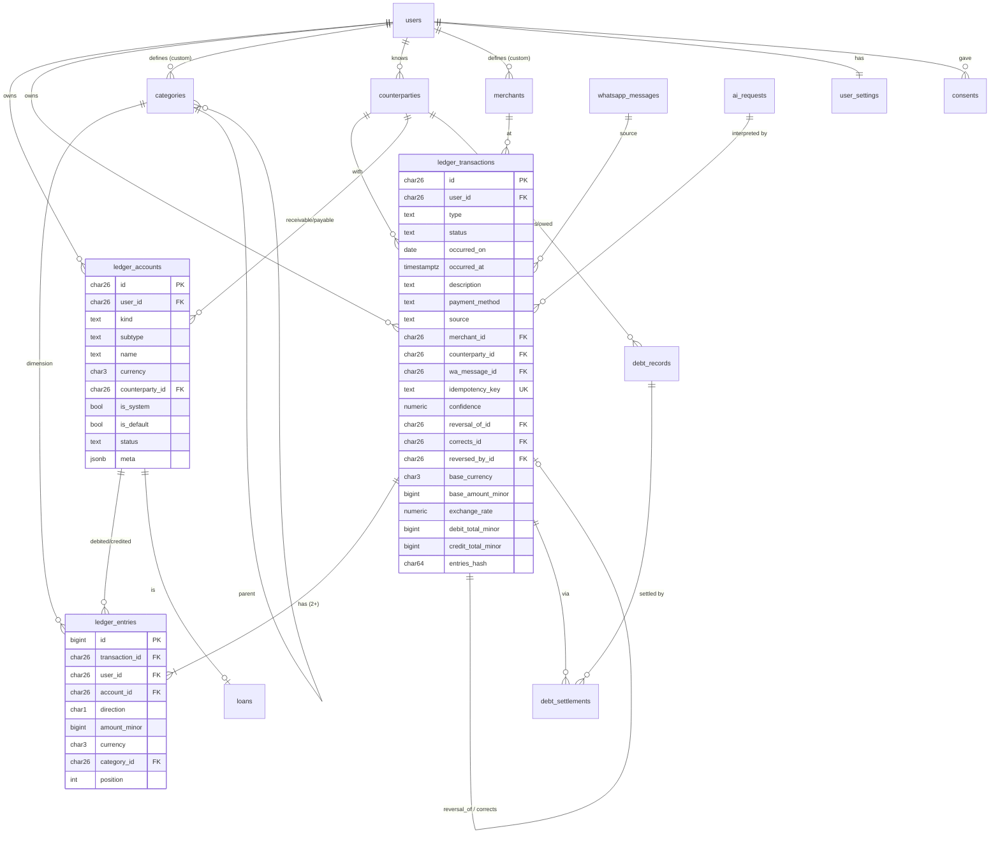
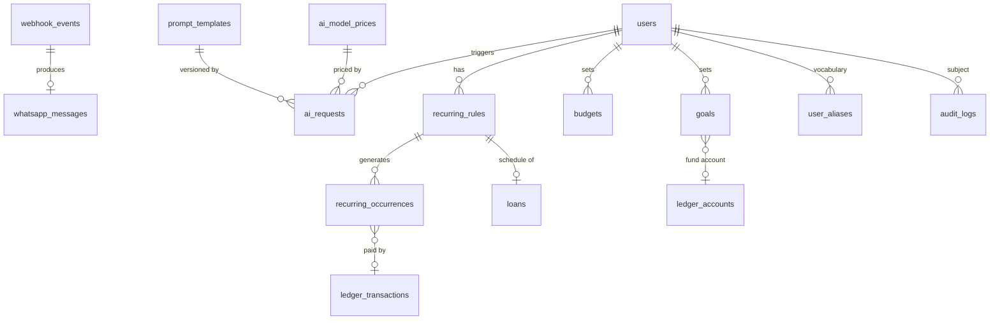

# Database Design (MySQL 8 / MariaDB 10.6+)

Conventions: `id` = ULID (`CHAR(26)`, time-ordered) except high-volume log tables (`BIGINT` auto-increment);
engine InnoDB, charset `utf8mb4`, collation `utf8mb4_unicode_ci` (case/accent-insensitive alias matching);
`jsonb` below means a `JSON` column used as an opaque blob (never queried inside);
money = `BIGINT *_minor` + `CHAR(3) currency`; timestamps `DATETIME(6)` in UTC; user-local
date as `DATE`; `user_id` on every user-owned table and **first** in composite indexes;
soft deletes only where noted (ledger rows are never deleted).

## 1. ER diagram: core ledger

## 2. ER diagram: planning, conversation, AI

## 3. Tables

Legend: **PK** primary key, **UK** unique, **FK**, `idx` index. Columns shown are the
meaningful ones; `created_at/updated_at` implied.

### 3.1 Identity and settings
**users**: `id PK`, `wa_id_enc` (encrypted), `wa_id_bidx UK` (HMAC blind index),
`name`, `timezone` (default `Asia/Kolkata`), `base_currency` (`INR`), `locale`
(`en-IN`), `language`, `status` (`pending_consent|onboarding|active|suspended|deleted`),
`onboarding_step`, `last_inbound_at` (24h-window logic), `deleted_at`.

**user_settings**: `user_id PK/FK`, `default_account_id`, `notification_prefs jsonb`
(per type on/off), `confirm_threshold_minor`, `duplicate_window_seconds`,
`pin_hash` (nullable), `feature_overrides jsonb`.

### 3.2 Ledger (see `ledger.md`)
**ledger_accounts**: columns in ER above; `UK(user_id, kind, name)` for non-counterparty
accounts, `UK(user_id, counterparty_id, kind)` for receivable/payable; `idx(user_id, subtype)`.

**ledger_transactions**: `type` enum
(`expense,income,transfer,cc_payment,lend,borrow,repayment_in,repayment_out,split_expense,
refund,emi_payment,adjustment,opening_balance`), `status`
(`posted|reversed|voided`), `source`
(`whatsapp_text|whatsapp_voice|whatsapp_image|manual|import|system`),
`recurring_occurrence_id`, `import_row_id`, `ai_request_id`, `related_transaction_id`.
Indexes: `UK(idempotency_key)`, `CHECK(debit_total_minor = credit_total_minor)`, `idx(user_id, occurred_on DESC)`,
`idx(user_id, type, occurred_on)`, `idx(user_id, merchant_id, occurred_on)`,
`idx(wa_message_id)`, `idx(user_id, status)`.

**ledger_entries**: `idx(account_id, id)` (balances), `idx(user_id, category_id,
transaction_id)` (category reports), `idx(transaction_id)`. Immutability: model guard (+ triggers
if the host permits). Balance: header `CHECK` + verify-before-commit (`ledger.md` §2).

**categories**: `id`, `user_id` (system defaults are copied per user), `parent_id`, `kind`
(`expense|income`), `name`, `icon`, `is_active`, `sort`; `UK(user_id, parent_id, name)` (case-insensitive via collation).
**user_aliases**: `user_id`, `entity_type` (`category|merchant|account|counterparty`),
`entity_id`, `alias` (normalised), `locale`, `source` (`seed|user|learned`),
`use_count`; `UK(user_id, entity_type, alias)`. Seeded global aliases (sabji → Vegetables)
are copied lazily or read from a system scope.
**merchants**: `id`, `user_id` (copied per user), `name`, `default_category_id`.
**counterparties**: `id`, `user_id`, `name`, `phone_enc` (nullable), `status`.

### 3.3 Debts and loans
**debt_records**: `id`, `user_id`, `counterparty_id`, `direction`
(`receivable|payable`), `opened_transaction_id`, `original_minor`, `due_on`,
`status` (`open|partial|settled|written_off`). Remaining = `original − Σ settlements`.
**debt_settlements**: `debt_record_id`, `transaction_id`, `amount_minor`.
**loans**: `account_id PK/FK`, `name`, `principal_minor`, `annual_rate_bps`,
`tenure_months`, `emi_minor`, `start_date`, `end_date`, `due_day`,
`payment_account_id`, `recurring_rule_id`, `status`.

### 3.4 Recurring, budgets, goals
**recurring_rules**: `user_id`, `kind`
(`subscription|emi|salary|rent|insurance|sip|bill|other`), `event_type`, `template jsonb`
(amount, accounts, category, merchant), `freq` (`daily|weekly|monthly|yearly`),
`interval`, `by_month_day`, `by_weekday`, `start_on`, `end_on`, `timezone`, `status`
(`active|paused|cancelled`), `next_due_on`.
**recurring_occurrences**: `rule_id`, `due_on`, `status`
(`expected|due|paid|skipped|cancelled`), `transaction_id`, `reminded_at`;
`UK(rule_id, due_on)`.
**budgets**: `user_id`, `scope` (`overall|category|account|goal`), `category_id`,
`account_id`, `goal_id`, `amount_minor`, `period` (`monthly`), `alert_thresholds`
(`{80,90,100}`), `last_alert_level_by_period`.
**goals**: `user_id`, `name`, `target_minor`, `deadline`, `fund_account_id`, `status`.
Progress = fund account balance; required monthly saving computed.

### 3.5 Messaging and conversation
**webhook_events** (implemented): `id bigint`, `provider`, `event_hash UK` (sha256 of the raw body), `payload` (raw JSON),
`processing_started_at`, `attempts`, `error`
(retention-limited), `status` (`received|queued|processed|failed|ignored`),
`attempts`, `error`, `received_at`, `processed_at`.
**whatsapp_messages** (implemented; no `conversation_id` yet; the 24h window uses `users.last_inbound_at`).
Body and payload are columns `text` / `payload` with Laravel `encrypted` casts; `dedupe_key UK` makes outbound
replies retry-safe; `in_reply_to`; `peer_bidx` (blind index of the other party's number, never the number);
`meta_timestamp`. **conversation_states**: `conversation_id PK`, `pending_intent`, `pending_payload jsonb`,
`awaiting` (`field|confirmation|choice`), `expires_at` (TTL, default 10 min),
`context_refs jsonb` (last transaction id, last counterparty).

### 3.6 AI
**prompt_templates**: `name`, `version`, `provider`, `model`, `body`, `schema_version`,
`status` (`draft|active|retired`); `UK(name, version)`; one active per
`(name, provider)`.
**ai_requests**: `id bigint`, `user_id`, `whatsapp_message_id`, `provider`, `model`,
`request_type`, `prompt_template_id`, `input_tokens`, `output_tokens`, `cached_tokens`,
`total_tokens`, `estimated_cost_micros`, `currency`, `latency_ms`, `status`,
`validation_result`, `error_code`, `input_enc` / `output_enc` (retention-limited),
`created_at`. Indexes `(user_id, created_at)`, `(model, created_at)`,
`(request_type, created_at)`.
**ai_model_prices**: `provider`, `model`, `input_per_mtok`, `output_per_mtok`,
`cache_read_per_mtok`, `cache_write_per_mtok`, `currency`, `effective_from`.

### 3.7 Audit
**audit_logs**: `id bigint`, `actor_type` (`user|admin|system`), `actor_id`, `user_id`,
`action`, `subject_type`, `subject_id`, `before jsonb`, `after jsonb`, `reason`,
`correlation_id`, `ip`; append-only; `idx(user_id, created_at)`.

## 4. Retention hooks
`webhook_events.payload`, `whatsapp_messages.*_enc`, `ai_requests.input_enc/output_enc`
and `media_assets` carry expiry/purge timestamps and are cleaned by scheduled jobs.
Ledger, audit, and cost metadata are retained long-term (see `security.md`).

## 5. Scale notes
Index keys on `utf8mb4` are limited (keep indexed VARCHARs ≤ 191 chars or use prefix/hash columns, e.g. `event_hash CHAR(64)`).
Start unpartitioned. Revisit partitioning `ledger_entries`/`audit_logs`/`ai_requests`
by month when a table exceeds hundreds of millions of rows or vacuum/index cost shows
up in measurements, not before.
