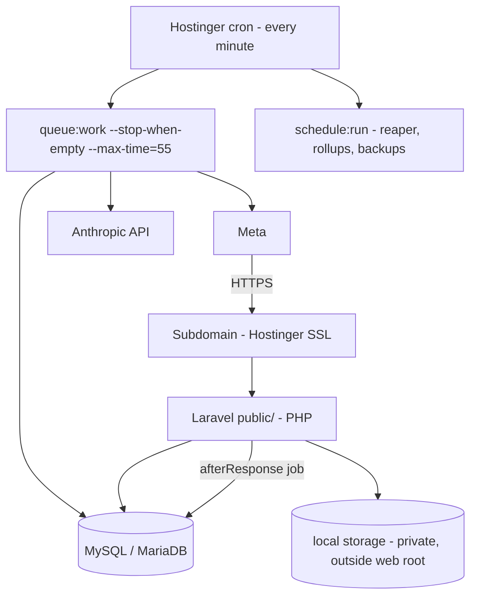

# Deployment and Operations (Hostinger subdomain + MySQL)

Designed for the most restrictive case, **shared hosting**: PHP + MySQL/MariaDB + cron, no
Redis, no long-running processes. It also works unchanged on a Hostinger Cloud/VPS plan, where
Redis + Horizon can be added later (see §7). Assumptions marked **verify** must be checked on
your actual plan.

## 1. Environments

| Env | Meta app / number | Anthropic key | DB | Webhook URL |
|---|---|---|---|---|
| local / sandbox | Meta **test number** | dev key, low spend cap | local MySQL/MariaDB | tunnel (cloudflared/ngrok) or simulator script |
| production | Meta app + your number | production key | Hostinger MySQL | `https://<sub>.<domain>/webhooks/whatsapp` |

(A staging subdomain is optional for personal use.) Credentials are never shared across
environments; real data never leaves production.

## 2. Topology



- **Request path:** the webhook verifies the signature, stores the event (`webhook_events`,
  `whatsapp_messages`), dispatches `ProcessInboundMessage` with `->afterResponse()` (runs after the
  200 is flushed, **verify** this works under the host's PHP handler), and returns 200 immediately.
- **Safety net:** cron runs the queue every minute, and the scheduled reaper re-dispatches events
  stuck in `received`. Worst-case latency is ~60 s; idempotency makes double processing harmless.
- **Per-user serialization:** `SELECT … FOR UPDATE` on the `users` row inside the processing transaction.
- **Media:** local `storage/app/private` (outside the web root) with expiry cleanup; S3-compatible
  storage is optional later.

## 3. Setup checklist (one-time)

1. Create the subdomain; set its document root to the app's `public/` directory (**verify**; if
   the panel cannot point at `public/`, use a documented `.htaccess`/symlink approach, never expose the project root).
2. PHP 8.3+ selected for the subdomain (your host offers 8.4, which CI also tests); required extensions: `pdo_mysql, mbstring, intl, bcmath, zip, curl, openssl`.
3. Create the MySQL database + user in hPanel; note host (often `localhost`), name, user, password.
4. Upload code (git deploy or SSH `git pull`); `composer install --no-dev --optimize-autoloader`
   (run locally and upload `vendor/` if the plan has no SSH/Composer).
5. Create `.env` on the server (never in git): `APP_ENV=production`, `APP_DEBUG=false`, `APP_KEY`, DB, Meta, Anthropic.
6. Generate the blind-index key (`php -r "echo bin2hex(random_bytes(32));"`) into `PII_BLIND_INDEX_KEY`; then
   `php artisan migrate --force`, `php artisan config:cache route:cache`, and create yourself with
   `php artisan moneytalks:user:create <your WhatsApp number> --name=<you>` (the number must be in `ALLOWED_WA_IDS`).
   **Keep `PII_BLIND_INDEX_KEY` and `APP_KEY` backed up off the server: losing either makes stored numbers unreadable.**
7. Add cron jobs (hPanel → Cron Jobs; the scheduler also runs the hourly recurring-payment reminders):
   ```
   * * * * * cd /path/to/app && php artisan schedule:run >> /dev/null 2>&1
   * * * * * cd /path/to/app && php artisan queue:work --stop-when-empty --max-time=55 --tries=3 >> /dev/null 2>&1
   ```
8. **Connect Meta** (see the go-live checklist below): set the callback URL to
   `https://<sub>.<domain>/webhooks/whatsapp`, the verify token, and subscribe to the `messages` field.
9. Confirm outbound HTTPS to `graph.facebook.com`, `api.anthropic.com` (and your STT host if voice is on) (**verify**), and that
   `.env`, `storage/`, `vendor/` return 403/404 from the web.

## 4. Environment variables
See `.env.example` (authoritative). Groups: app, DB (`DB_*`), queue/cache/session = `database`,
Meta (`META_*`, `ALLOWED_WA_IDS`), AI (`ANTHROPIC_API_KEY`, `AI_*`), user defaults.
Later: `PII_BLIND_INDEX_KEY`, `STT_*`, `RATE_LIMIT_*`, `FEATURE_*`.

## 5. Deploying (no CI/CD)
Manual: pull the code on the Hostinger host, `composer install --no-dev`, `php artisan migrate --force`, `php artisan config:cache`. Run `./vendor/bin/pest` locally first. Rollback = previous git tag;
migrations are expand/contract so the previous release keeps working. Cron picks up new code on the next minute; there is no daemon to restart.

## 6. Monitoring and backups
- `php artisan moneytalks:health` checks, in one table: database, **scheduler heartbeat** (written every minute by the cron job; stale > 5 min means cron is not
  running), queue backlog, failed jobs, webhook events stuck in `received`/`failed`, the last nightly ledger verification, AI error rate/paused/budget, and failed
  outbound messages. It exits 1 when a critical check fails (database, scheduler, queue, webhooks, ledger).
- `GET /health` with `Authorization: Bearer <HEALTH_TOKEN>` returns names and pass/fail only (never counts or content): point an uptime monitor at it (503 when failing).
  It answers 404 until `HEALTH_TOKEN` is set. `/up` is Laravel's plain liveness probe.
- **Cost and the kill switch:** `moneytalks:cost:report` (AI by feature, WhatsApp by pricing category, cost per transaction / active user);
  `moneytalks:ai:pause "reason"` / `moneytalks:ai:resume` stop and restart every model, vision and transcription call (reports, balance and undo keep working);
  `AI_DAILY_BUDGET_GLOBAL_USD` closes AI automatically for the rest of the day once reached.
- **Backups:** Hostinger's own backups (**verify** retention) **plus** a scheduled `mysqldump`
  (gzip, encrypted with a key kept off the server) shipped to off-host storage; restore drill
  quarterly with the ledger invariant check as the acceptance test.

## 7. Upgrade path (if you outgrow shared hosting)
Hostinger VPS/Cloud: switch `QUEUE_CONNECTION`/`CACHE_STORE`/`SESSION_DRIVER` to `redis`, run a
supervised queue worker (or Horizon), keep the same code. Moving to PostgreSQL is *not* planned;
the schema is kept MySQL/MariaDB-portable.

## 8. Go-live checklist for the Meta side (what you need to provide)

1. A Meta developer app with the **WhatsApp** product; note the **App secret** -> `META_APP_SECRET`.
2. A WhatsApp Business Account and a phone number: for personal use the free **test number** is fine
   (verify current limits; you add your own number as an allowed recipient). Note the **Phone number ID** ->
   `META_PHONE_NUMBER_ID` and the WABA id -> `META_WABA_ID`.
3. A **System User permanent access token** with the `whatsapp_business_messaging` permission ->
   `META_ACCESS_TOKEN`. (The temporary 24h token in the dashboard will stop working.)
4. Choose any long random string -> `META_WEBHOOK_VERIFY_TOKEN`.
5. Set `WHATSAPP_PROVIDER=meta`, `ALLOWED_WA_IDS=<your number, digits, country code>` and run
   `php artisan moneytalks:user:create <your number>`.
6. In the app dashboard: callback URL + verify token (Meta calls the GET handshake), subscribe to `messages`.
7. Set `AI_PRIMARY_PROVIDER=anthropic` and `ANTHROPIC_API_KEY` (an API key from the Anthropic Console; use a key
   with a spend limit). Optional: `php artisan moneytalks:ai:eval --live` first. It sends the ~60 eval messages to
   the real model (roughly 10 US cents with Haiku; the command prints an estimate and asks before spending) and
   reports real accuracy, latency and cost.
8. Send "help" from your phone to the number: you should get the help text (no AI call). Then send
   "spent 250 on vegetables": you should get "✅ Recorded ₹250 expense under Vegetables." and `balance` should show it.
   If nothing arrives: check `php artisan moneytalks:whatsapp:messages`, the `webhook_events` table (status/error),
   `php artisan moneytalks:ai:usage`, and `storage/logs`.
9. Remember the 24-hour window: the bot can only reply while you have messaged it in the last 24 hours.

## 9. Optional: voice notes
Set `STT_PROVIDER=openai_compatible`, `STT_API_KEY` (and `STT_BASE_URL`/`STT_MODEL` for a non-OpenAI service). Leave `STT_PROVIDER=none` to decline voice notes politely. Send yourself a voice note "spent 250 on vegetables": you should see "🎙️ I heard: ..." and a Confirm button. Receipt photos need only the Anthropic key (vision uses the same Haiku model).
