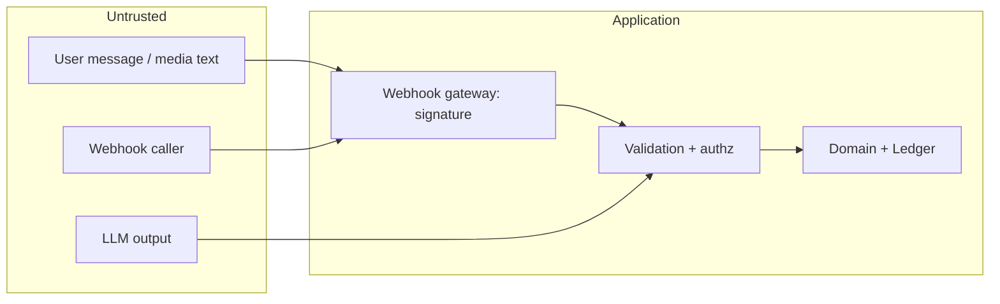

# Security Model

## 1. Trust boundaries

Three things are treated as **untrusted input**: the webhook request, the user's text and
media, and the **LLM's output**. Only the validated domain command crosses into the ledger.

## 2. Webhook security
- HTTPS only; HSTS. GET verification token compared in constant time.
- POST: HMAC-SHA256 (`X-Hub-Signature-256`) over the raw body with the app secret
  *before* parsing; constant-time compare; reject otherwise (403, no detail).
- Verify `phone_number_id` / WABA ID match ours.
- Replay protection: unique `wa_message_id` and `event_hash`; processed-once
  semantics (idempotency, §6). Optionally reject payloads with implausible timestamps.
- Payload size cap; JSON depth cap; per-IP/global rate limit (Meta egress IP ranges can be
  allow-listed at the edge as an additional layer, not as the only control).

## 3. Authentication and authorization
- **End users:** identity is the Meta-authenticated sender `wa_id`. This is a
  *possession* factor only (SIM-swap, shared device risk). Mitigations: optional **PIN
  step-up** (hashed with Argon2id) for export-all, delete-account/history, very large
  transactions; rate-limited PIN attempts; user can set it by WhatsApp ("set a PIN").
  Messages with PIN are deleted from our store after verification and the user is told to
  delete the WhatsApp message.
- **Authorization:** every query/command is scoped by `user_id` from the resolved
  session, never from AI output. Eloquent global scope + policies; cross-user entity
  references are impossible because the resolver only searches the caller's records.
- **Admins:** separate `admins` table/guard, Filament, **mandatory MFA**, role-based
  access (spatie/laravel-permission: `support`, `finance`, `ops`, `superadmin`), session
  hardening (secure/HttpOnly/SameSite cookies, short idle timeout), optional IP
  allow-list, audit log of every view of user data. Support staff see masked financial
  values by default; "reveal" is a logged action with a reason.
- Admin never sees secrets (tokens/keys are not stored in DB-visible form or shown).
- API (`/api/v1`): token auth (Sanctum) for admin/future first-party clients; strict
  per-route abilities.

## 4. Secrets
- Environment variables / secret manager only; never in git. `.env.example` has names only.
- Meta token = permanent System User token, stored encrypted if persisted; rotate on a
  schedule and on staff changes. App secret/verify token rotation procedure documented
  (dual-secret acceptance window).
- `APP_KEY` rotation supported via Laravel's previous-keys mechanism.
- Separate credentials per environment; production credentials never present locally.
- Log scrubbing: processors redact `Authorization`, tokens, `*_secret`, PAN-like digit
  runs, and message bodies above debug level.

## 5. Data protection
- TLS in transit everywhere (app↔DB too where the host exposes TLS; otherwise DB stays on localhost).
- Encryption at rest: managed-database disk encryption + encrypted backups. **Application-
  level encryption** (Laravel `encrypted` casts) for: `wa_id` (+ HMAC blind index for
  lookup), message bodies/payloads, AI request/response bodies, counterparty phone,
  PIN hash material, MFA secrets. Transaction `description`/amounts are *not* app-encrypted
  (needed for search/aggregation); they rely on disk/backup encryption and access control.
  *Tradeoff stated explicitly:* field-level encryption of everything would break reporting.
- **Data minimisation:** cards store issuer, nickname, last4, limit, cycle dates. **No PAN,
  no CVV, no expiry.** If a user types a full card number, the preprocessor masks it before
  storage/AI and replies not to send it.
- Never log: tokens, API secrets, full card numbers, credentials.
- **AI privacy:** only the minimal context goes to the LLM (message, matched aliases,
  account names, pending payload). Never the transaction history. Query answers are
  computed in SQL; the LLM sees only the *result* when an explanation is needed.
  Anthropic data-handling terms to be reviewed and disclosed in the consent text.
- Media: object storage with private ACLs, signed short-lived URLs, expiry lifecycle rule,
  malware scan, MIME sniffing and size limits; no execution of uploaded content; PDFs/
  images parsed in isolation (statement import).

## 6. Idempotency and integrity
- `unique(whatsapp_messages.wa_message_id)`; `unique(webhook_events.event_hash)`.
- `unique(ledger_transactions.idempotency_key)` with `{wa_message_id}:{item_index}`.
- Notifications `dedupe_key` (e.g. `emi:{loan}:{due_date}`) prevents double reminders.
- Append-only ledger + DB-enforced balancing + audit logs (see `ledger.md`).
- Per-user processing lock; row locks on reversal; all financial writes in transactions.

## 7. Prompt-injection defense (summary; details in `ai.md`)
Untrusted-content instruction · delimiters · forced schema output · no executable tools ·
server-side validation and entity resolution · authorization independent of AI ·
confirmation for high-risk/bulk/destructive intents · amount caps and write caps ·
suspicious-content flag (`unknown/injection_suspected`) logged for review. Image/OCR text
is treated exactly like user text.

## 8. Web/API hardening (admin + API)
CSRF on web routes; output encoding (Blade/Filament escaping, no raw HTML from user
data); parameterised queries only (Eloquent/query builder; **no AI-generated SQL**);
security headers (CSP, X-Content-Type-Options, frame-ancestors, Referrer-Policy);
request validation classes; rate limiting per route (`throttle`) and login lockout;
dependency audit (`composer audit`) and Dependabot in CI; secrets scanning in CI.

## 9. Retention (proposed defaults; **needs legal review**)

| Data | Default | Notes |
|---|---|---|
| Conversation state | 10 min TTL | |
| Raw webhook payloads | 14 days | debugging only |
| WhatsApp message bodies | 90 days | metadata (ids, status, cost) kept as long as the account |
| AI request/response bodies | 30 days (0 = off) | token/cost metadata kept permanently |
| Media / receipts | deleted after extraction, max 7 days if user keeps pending | opt-in keep |
| Exports | 24 h signed link, then deleted | |
| Ledger + audit logs | life of account | after deletion: only what law requires, anonymised otherwise |
| Admin access logs | 1 year+ | |

## 10. User privacy rights (WhatsApp flows)
`show my data`, `export my data` (machine-readable bundle), `stop notifications`
(immediate), `delete my transaction history`, `delete my account`. Destructive ones use
the deterministic confirmation flow (+ PIN if set), a cool-off message, then execute as
a job: hard-delete PII and messages, **soft-anonymise** ledger rows only where retention
is legally required. Consent is versioned and revocable; revoking AI processing stops
non-deterministic features for that user.

## 11. Backup and recovery
Automated encrypted DB backups (host backups **plus** our own scheduled `mysqldump` shipped off-host; PITR only if the plan has binlogs); backup success monitored and alerted;
**quarterly restore drill** into a scratch environment with a ledger-invariant check
(ΣD = ΣC) as the acceptance test; object-storage versioning; documented RPO/RTO targets
(proposed: RPO ≤ 5 min, RTO ≤ 2 h; to be confirmed against hosting costs).

## 12. Threat summary

| Threat | Control |
|---|---|
| Forged webhook | HMAC signature, phone_number_id check |
| Replayed webhook | unique IDs, idempotency keys |
| Prompt injection / "delete all" | schema-only output, no tools, confirmation, authz |
| Hallucinated amount/category | amount cross-check, entity resolver, risk score |
| Account takeover via SIM swap | optional PIN, high-risk step-up, notifications on sensitive actions |
| Data leak via logs | redaction, no bodies at info level |
| Cost-abuse (spam, AI loops) | rate limits, quotas, kill switch, invite gating |
| Malicious media | size/type limits, scan, isolation, expiry |
| Insider/admin misuse | RBAC, MFA, masked values, audit logging |
| Double-spend of a webhook | idempotency + DB uniqueness |

## 12. What is implemented (M12, personal mode)

Read this before the proposals above: it is what the code does today.

- **Retention (§9):** `moneytalks:retention:purge` (daily) clears raw webhook payloads after 14 days, WhatsApp message bodies after 90 days and leftover export files after 24 hours;
  `moneytalks:ai:purge` clears AI bodies after `AI_RETENTION_DAYS`; conversation states expire after 10 minutes. Raw webhook payloads are **encrypted at rest** (they contain
  every sender's text and number, strangers included). Voice and photos are never stored.
- **Privacy rights (§10), console only:** `moneytalks:user:export` writes everything held about a user as JSON (file mode 0600); `moneytalks:user:erase` removes personal data.
  There is deliberately **no WhatsApp command** for either: a stolen phone must not be able to export or wipe the books, and the PIN step-up in §10 is therefore **not implemented**
  (nothing destructive or bulk-exporting is reachable from chat; undo, corrections and the CSV export of the user's own transactions are).
- **Erasure semantics:** the ledger is append-only and may have to be kept for accounting, so erasure *anonymises* it: messages, AI bodies, aliases, pending conversations and
  the user's name and number are removed (the number can never match again, so the same person can sign up fresh); every person becomes "Person N" (also in the per-person
  accounts); goal, loan and recurring names are neutralised; and the free-text `description` of every ledger transaction is cleared. That column is the **only** ledger
  column that may change, and only to NULL (a DB trigger enforces it); it is not part of the tamper-evidence hash, so `moneytalks:ledger:verify` still passes.
  Amounts, dates, accounts and categories remain (anonymous). Webhook events that concern only this person are deleted; one that also carries another sender's messages is
  kept (encrypted) until the 14-day purge. Legal review of what must be retained is still needed before opening sign-ups.
- **Backups (§11):** `moneytalks:backup` (daily 03:40) = `mysqldump` (password via environment, never argv) -> gzip -> libsodium authenticated encryption, files mode 0600,
  oldest pruned (`BACKUP_KEEP`). A wrong key, a flipped bit or a truncated file is refused. `moneytalks:backup:verify` checks a backup is a complete dump;
  `moneytalks:backup:restore --into=<empty scratch db>` is the restore drill, ending with the ledger verifier. Copying backups off the server, and keeping
  `BACKUP_ENCRYPTION_KEY` off the server too, is the operator's job (docs/runbooks.md).
- **Authentication boundaries:** webhook HMAC over the raw body (constant-time, fails closed), allow-listed senders only (strangers' text is never stored), `/health` behind a bearer token,
  fake providers refused in production, media downloads only from Meta's domains over https without redirects, files checked against their real signature before a vendor sees them.
- **Independent review (M12):** a read-only review of the code found no critical or high issues. Medium findings fixed: plaintext, never-purged webhook payloads (now encrypted + purged);
  loan creation and voice-sent changes reaching the ledger or state without a Confirm tap (loans now always ask; budgets, goals, recurring changes and undo ask when they come from
  voice or a photo). Low findings fixed: exception text persisted (now class names only), media URL host check and redirects, content sniffing, CSV file permissions and whitespace-hidden
  formulas, untrusted receipt captions, trusted-proxy setting for rate limiting, visibility of missing DB triggers (`moneytalks:health`).
- **Known limits:** the DB triggers are best-effort on hosts without the TRIGGER privilege (the app guards and the nightly verifier remain); no MFA/RBAC because there is no admin UI;
  transcription cost is not priced; Larastan runs in CI only (the cloud authoring sandbox cannot download it).
