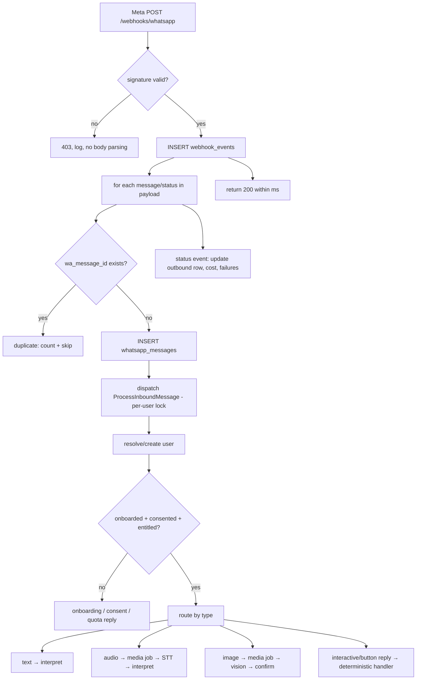

# WhatsApp Architecture (Meta Cloud API, direct)

> Numeric limits below (button/list caps, file sizes, window length) are design
> assumptions to **re-verify against Meta's current docs** at implementation time.

## 1. Provider abstraction

```php
interface WhatsAppProvider {
    public function parseWebhook(Request $r): array;            // → InboundEvent[] (normalised DTOs)
    public function verifyChallenge(Request $r): ?string;       // GET handshake
    public function verifySignature(string $rawBody, ?string $sig): bool;
    public function sendText(OutboundText $m): SendResult;
    public function sendInteractive(OutboundInteractive $m): SendResult; // buttons/list
    public function sendTemplate(OutboundTemplate $m): SendResult;
    public function sendDocument(OutboundDocument $m): SendResult;
    public function downloadMedia(string $mediaId): MediaStream;
    public function markRead(string $waMessageId): void;
}
// MetaWhatsAppProvider is the only class that knows Graph API URLs, field names, versions.
```
The domain only sees `InboundMessage`, `InboundStatus`, `Outbound*` DTOs.

## 0. What is implemented (Milestone 4)

Implemented and tested: `WhatsAppProvider` interface; `MetaWhatsAppProvider` (send text / reply buttons /
templates, mark-read, webhook parsing for text, audio, image, document, interactive and button replies,
delivery statuses with pricing; sending a document: media upload then `type: document`, used for CSV exports); `FakeWhatsAppProvider` (same parsing and signature check, no network; refused
in production); GET handshake; HMAC signature check on the raw body; durable `webhook_events`; idempotent
inbound by `wa_message_id`; atomic event claim; scheduled reaper; per-user lock and rate limit; allow-list
gating; outbound service with the 24-hour window check, retries and retry-safe dedupe keys; delivery receipts;
signed-webhook simulator. **Handler:** `InterpretationHandler` (M5, see `ai.md` section 0) records expenses, income and
transfers; `AcknowledgeHandler` (a "message received" echo) is kept only as a pipeline test handler (`WHATSAPP_HANDLER`). **Media (M10):** `downloadMedia()` (two-step Graph fetch, size checked before downloading, bearer token only to Meta's https URL), `MediaGuard` (MIME allow-list, size cap, daily count per user), voice notes and receipt photos (see `ai.md`); media is held in memory only, never written to disk. **Not implemented yet:**
list messages, notification templates, statement documents; `markRead` is best-effort only.

Local development: `WHATSAPP_PROVIDER=fake`, then `php artisan serve` and
`php artisan moneytalks:whatsapp:simulate "spent 250 on vegetables"`; inspect with
`php artisan moneytalks:whatsapp:messages`. The simulator supports `--id` (resend the same message id),
`--bad-signature`, `--kind=audio|image|button|status`, `--from`, and `--handshake`.

Behaviour worth knowing:
- Route: `GET|POST /webhooks/whatsapp` (no session, no CSRF, throttled per IP).
- **Strangers:** a sender who is not provisioned, not in `ALLOWED_WA_IDS`, or suspended gets no reply, no AI,
  and their message content is **not stored** (only that a message arrived). An empty allow-list ignores everyone.
- **Failures are kept:** a handler error leaves the inbound text stored (`processing_failed`) and the event
  `failed`; the reaper retries with linear backoff up to `WHATSAPP_MAX_ATTEMPTS`, after which it logs
  `whatsapp.events_exhausted` at critical level. Outbound failures are stored with a reason (e.g.
  `outside_window_no_template`) and are not auto-resent.
- **Meta facts to re-verify** before go-live: Graph API version, the error codes treated as retryable
  (130429, 131056, 80007) and the out-of-window code (131047), button/list limits, and the webhook field names.

## 2. Inbound pipeline



Rules:
- **GET** `hub.mode=subscribe` + `hub.verify_token` (constant-time compare) → echo
  `hub.challenge`.
- **POST** verify `X-Hub-Signature-256` = `sha256=HMAC(app_secret, rawBody)` against the
  **raw bytes** before JSON decoding. Constant-time compare. Reject if the
  `phone_number_id` is not ours.
- Controller does only: verify → persist → enqueue → 200. No AI, no ledger, no
  outbound calls.
- A payload may contain several messages and statuses; handle each independently.
- Processing order is by user lock, then by Meta `timestamp` for queued backlog.
- `markRead` is sent when processing starts (cheap UX signal).

## 3. Outbound pipeline

All outbound goes through `OutboundMessageService` (queue `outbound`):

1. Persist `whatsapp_messages` (direction `out`, status `queued`).
2. **Window check:** if `now < conversations.window_expires_at` → free-form allowed;
   otherwise only a template. A request that has no template mapping is *not sent* and is
   recorded `failed: outside_window_no_template` (never silently dropped).
3. Send via provider with retry/backoff on 429/5xx; honour rate limits.
4. Store Meta's returned message ID; later **status webhooks** (`sent`, `delivered`,
   `read`, `failed`) update the row and carry pricing info into `cost_*` columns.
5. Failures are visible in the admin panel and counted in metrics.

## 4. Message types and UX

| Need | Mechanism |
|---|---|
| Simple confirmation | Plain text with WhatsApp formatting (`*bold*`, `_italic_`) |
| Confirm / Edit / Cancel, Yes / No | Reply buttons (≤ 3). Button IDs carry `{action}:{pending_id}` and are validated server-side |
| Choose category/account/method | List message (≤ 10 rows; paginate or fall back to text) |
| Reports | Text, short sections, no wide tables |
| Exports (CSV/XLSX/PDF) | Generate → upload media → send document (inside window) |
| Reminders / reports out of window | Template messages (`notifications` registry) |
| Typing/ack for slow jobs | Optional "working on it…" only when a job exceeds a threshold |

Button taps arrive as `interactive` replies and are handled by a **deterministic router**
(no LLM): the button ID maps to a pending-state action. Stale/expired pending IDs get a
polite "that request expired, please send it again".

## 5. Conversation state

`conversation_states` holds one pending item per conversation:
`pending_intent`, `pending_payload` (partially filled proposal), `awaiting`
(`field|confirmation|choice`), `expires_at` (default 10 min, configurable).

Example: "spent 500" → proposal missing `category` → state saved, reply "₹500 for what?"
→ next message "groceries" is interpreted **with the pending payload as context** (small
prompt: schema + pending fields, not the chat history) → merge → validate → post → clear.
A message that clearly starts a *new* intent (the classifier says so) abandons the pending
state after telling the user. Cap: one pending item, max 3 clarification turns, then
"I couldn't complete that; start again with e.g. 'spent 500 on groceries'".

## 6. Onboarding and consent

1. First inbound message creates the user in `pending_consent` (invite code checked at
   launch).
2. Welcome + plain-language disclosure of: data stored, messages processed by AI
   (Anthropic), media handling, notifications, deletion rights. Buttons: **Agree /
   Details / Cancel**. Consent is stored (`consents`, with the message ID as evidence).
3. Short setup: name → (timezone, currency defaulted: Asia/Kolkata, INR) → default
   account (offered, skippable) → starter categories seeded automatically.
4. Onboarding runs inside the user-initiated window, so no template is required.

## 7. Commands and help

`/help /report /balance /budget /debts /subscriptions /settings /export` are
recognised by the Preprocessor with **no AI call**. Natural-language equivalents go
through the interpreter. `help` returns a short example list (§96).

## 8. Media

| Type | Flow |
|---|---|
| Image | Webhook → `DownloadMedia` job (immediately, URL expires) → size/type/malware-scan checks → object storage (`expires_at`) → vision model → structured extraction → **always confirm** (Confirm/Edit/Cancel) → ledger |
| Voice | Same download → `SpeechToTextProvider` → transcript becomes a normal text message with `source = whatsapp_voice` and the language detected → standard pipeline (low-confidence transcripts raise the confirmation bar) |
| Document (statement) | Phase 8 import pipeline |

Limits enforced before any processing: max size, allowed MIME types, per-user daily media
count. Receipts are deleted from storage after extraction unless the user opts to keep
them.

## 9. Rate limiting and abuse

- Per-user: messages/min, AI requests/min, reports/hour, media/day. Over limit → one
  polite message, then silently drop for the cool-down (avoids replying-to-spam cost).
- Global: queue depth guard and an admin **kill switch** (reject new AI work).
- Unknown/never-onboarded numbers: minimal reply, strict cap, no AI.

## 10. Environment variables

```
WHATSAPP_PROVIDER=meta
META_GRAPH_VERSION=            # pinned, bumped deliberately
META_APP_ID=
META_APP_SECRET=               # signature verification
META_WABA_ID=
META_PHONE_NUMBER_ID=
META_ACCESS_TOKEN=             # permanent System User token (never the 24h temp token)
META_WEBHOOK_VERIFY_TOKEN=
```

## 11. Pre-launch Meta checklist (non-code, has lead time)
Business verification · dedicated number registered on Cloud API · display name approved ·
webhook subscribed to `messages` · System User + permanent token · message templates
submitted (reminders, monthly report, budget alert, due notices) · payment method added to
the WABA.
